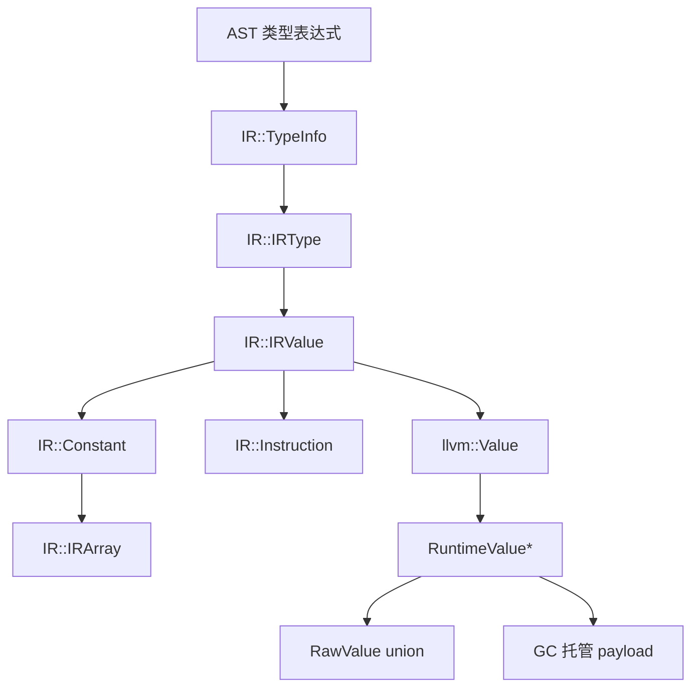

# SakuraE Value 体系

[English Version](value.md)

本文档描述前端、SakuraE IR、LLVM Codegen 和 Runtime 之间的值表示。各层通过转换关联，并不是跨编译器层和运行时层的继承关系。

## 1. 分层模型



`IRValue` 是编译器 IR 表示，`llvm::Value` 是 Codegen 生成的 LLVM 表示，`RuntimeValue` 是 `__print` 等运行时调用使用的表示。`RuntimeValue` 不是 `llvm::Value` 的子类，也不与其继承。

## 2. 编译期类型信息

`TypeInfo` 用于前端和 IR 构建期间描述源语言类型；当类型值被具体生成到 LLVM 时，会 lowering 为缓存的 `Runtime::TypeInfo` 对象。

```cpp
enum TypeID {
    Int32,
    Int64,
    UInt32,
    UInt64,
    Float32,
    Float64,
    Bool,
    Char,
    String,
    Null,
    Custom,
    Array,
    Pointer,
    Ref
};

class ArrayTypeInfo {
    std::vector<TypeInfo*> elementTypes;

public:
    ArrayTypeInfo(std::vector<TypeInfo*> elements);
    std::size_t length();
    TypeInfo* getElementTy();
};

class PointerTypeInfo {
    TypeInfo* elementType;

public:
    PointerTypeInfo(TypeInfo* element);
    TypeInfo* getElementTy();
};

class RefTypeInfo {
    TypeInfo* elementType;

public:
    RefTypeInfo(TypeInfo* element);
    TypeInfo* getElementTy();
};

class TypeInfo {
    TypeID typeID;
    std::variant<
        std::monostate,
        ArrayTypeInfo,
        PointerTypeInfo,
        RefTypeInfo
    > complexTypeInfo;

public:
    TypeInfo(TypeID tid);
    TypeInfo(std::vector<TypeInfo*> tids);
    TypeInfo(TypeID id, TypeInfo* elementType);
    ~TypeInfo() = default;

    bool isArray();
    bool isPointer();
    bool isRef();
    const TypeID& getTypeID();
    IRType* toIRType();

    static TypeInfo* makeBasicTypeID(TypeID typeID);
    static TypeInfo* makeArrayTypeID(std::vector<TypeInfo*> types);
    static TypeInfo* makePointerTypeID(TypeInfo* typeID);
    static TypeInfo* makeRefTypeID(TypeInfo* typeID);
    static void clearAll();
};
```

`TypeInfo::toIRType()` 将基础类型映射到对应的 `IRType`，将数组映射到 `IRArrayType`，将指针映射到 `IRPointerType`，并将引用映射为以被引用元素类型为目标的 IR 指针类型。

## 3. IR 类型和值

当前 IR 类型 ID 为：

```cpp
enum IRTypeID {
    VoidTyID,
    Integer32TyID,
    Integer64TyID,
    IntegerNTyID,
    UInteger32TyID,
    UInteger64TyID,
    UIntegerNTyID,
    Float32TyID,
    Float64TyID,
    FloatNTyID,
    CharTyID,
    BoolTyID,
    TypeInfoTyID,
    StringTyID,
    RefTyID,
    PointerTyID,
    ArrayTyID,
    FunctionTyID,
    BlockTyID
};
```

IR 值基类完整定义为：

```cpp
class IRValue {
protected:
    IRType* type;
    fzlib::String name;

public:
    explicit IRValue(IRType* ty, fzlib::String n);
    explicit IRValue(IRType* ty);
    virtual ~IRValue() = default;

    IRType* getType() const;
    void setName(const fzlib::String& n);
    void setType(IRType* t);
    const fzlib::String& getName();
};
```

指令是带有操作码和操作数的 `IRValue`：

```cpp
class Instruction : public IRValue {
    OpKind kind = OpKind::empty;
    std::vector<IRValue*> args;
    Block* parent = nullptr;

public:
    Instruction(OpKind k, IRType* t);
    Instruction(OpKind k, IRType* t, std::vector<IRValue*> params);

    bool isTerminal();
    bool isLValue();
    bool isRValue();
    void setParent(Block* blk);
    Block* getParent();
    const std::vector<IRValue*>& getOperands();
    IRValue* arg(std::size_t pos);
    const OpKind& getKind();
    IRValue* operator[](std::size_t pos);
    fzlib::String toString();
};
```

## 4. 常量和数组

`Constant` 使用 `std::variant` 保存编译期值，并单独保存其 IR 类型：

```cpp
class Constant : public IRValue {
private:
    std::variant<
        std::monostate,
        std::int32_t,
        std::int64_t,
        std::uint32_t,
        std::uint64_t,
        double,
        float,
        fzlib::String,
        std::int8_t,
        bool,
        TypeInfo*,
        IRArray*
    > content;
    PositionInfo createInfo;

public:
    static Constant* get(std::uint32_t value, PositionInfo info = {});
    static Constant* get(std::uint64_t value, PositionInfo info = {});
    static Constant* get(std::int64_t value, PositionInfo info = {});
    static Constant* get(std::int32_t value, PositionInfo info = {});
    static Constant* get(float value, PositionInfo info = {});
    static Constant* get(double value, PositionInfo info = {});
    static Constant* get(const fzlib::String& value, PositionInfo info = {});
    static Constant* get(std::int8_t value, PositionInfo info = {});
    static Constant* get(bool value, PositionInfo info = {});
    static Constant* get(TypeInfo* value, PositionInfo info = {});
    static Constant* get(IRArray* value, PositionInfo info = {});
    static Constant* getDefault(IRType* type, PositionInfo info);
    static Constant* getFromToken(const Token& token);
    static void clearAll();

    template<typename T>
    const T& getContentValue() const;

    const PositionInfo& getInfo() const;
    fzlib::String toString();
    llvm::Type* toLLVMType(llvm::LLVMContext& context);
};
```

`IRArray` 是 IR 阶段的复合值。构造函数会检查所有元素的 IR 类型是否一致。它不是 Runtime 使用的堆 payload：

```cpp
class IRArray {
    std::vector<IRValue*> arrContent;
    PositionInfo createInfo;

public:
    IRArray(std::vector<IRValue*> values, PositionInfo info);
    IRType* getType();
    std::vector<IRValue*>& getArray();
    IRValue* getHead();
    std::size_t getSize();
    PositionInfo& getInfo();
    bool isEqual(std::vector<IRValue*> values);

    static IRArray* createArray(std::vector<IRValue*> values, PositionInfo info);
    static void clearArrayPool();
};
```

## 5. RuntimeValue

Runtime 使用带标签的 union 包装值。生成代码与 Runtime 之间通过 `RuntimeValue*` 传递，不按值传递 `RuntimeValue`。

```cpp
enum class RuntimeType : std::uint8_t {
    I8,
    I32,
    I64,
    U8,
    U32,
    U64,
    F32,
    F64,
    Bool,
    String,
    Array,
    Struct,
    Pointer,
    TypeInfo
};

struct RuntimeString {
    const char* data;
    std::uint64_t length;
};

struct RuntimeAggregate {
    void* data;
    std::uint64_t length;
    std::uint64_t stride;
    const void* layout;
};

union RawValue {
    std::int8_t i8;
    std::int32_t i32;
    std::int64_t i64;
    std::uint8_t u8;
    std::uint32_t u32;
    std::uint64_t u64;
    float f32;
    double f64;
    bool boolean;
    RuntimeString string;
    RuntimeAggregate aggregate;
    void* pointer;
};

struct RuntimeValue {
    RuntimeType type;
    RawValue data;
};

extern "C" RuntimeValue* __runtime_alloc_value();
```

当前 ABI 是一个字节的 tag、ABI 对齐填充和 32 字节的 raw union。LLVM 中对应：

```llvm
%sakurae.RuntimeValue = type { i8, [7 x i8], [4 x i64] }
```

标量使用对应 union 成员，字符串使用 `RuntimeString`，数组和结构体在装箱值中使用 `RuntimeAggregate`。当前实现仍保留 `Pointer` 标签，用于被装箱的指针值。

## 6. LLVM 装箱模型

`LLVMCodeGenerator::boxRaw(llvm::Value*, IR::IRType*, LLVMFunction*)` 分配 wrapper、写入 Runtime tag，并把原始值写入 union 存储区。`unboxRaw(llvm::Value*, IR::IRType*, LLVMFunction*)` 根据 IR 类型对应的 LLVM 类型读取 raw 值。

当前 tag 映射如下：

| IR 类型 | Runtime tag |
| --- | ---: |
| `CharTyID` | `I8` / 0 |
| `Integer32TyID` | `I32` / 1 |
| `Integer64TyID` | `I64` / 2 |
| `UInteger32TyID` | `U32` / 4 |
| `UInteger64TyID` | `U64` / 5 |
| `Float32TyID` | `F32` / 6 |
| `Float64TyID` | `F64` / 7 |
| `BoolTyID` | `Bool` / 8 |
| `StringTyID` | `String` / 9 |
| `ArrayTyID` | `Array` / 10 |
| `PointerTyID` | `Pointer` / 12 |
| `RefTyID` | `Pointer` / 12 |
| `TypeInfoTyID` | `TypeInfo` / 13 |
| 未知类型 | `Pointer` / 12 |

`U8` 和 `Struct` 已存在于 Runtime ABI，但当前 IR tag 函数没有为它们提供完整、独立的 Codegen 分支。这是当前实现状态，不代表 ABI 中没有这些枚举项。

## 7. GC 所有权和根

`RuntimeValue` wrapper 由 `__runtime_alloc_value()` 使用 `malloc` 分配，并由 Runtime 记录以便程序退出时清理；wrapper 本身不是 GC payload。payload 的所有权独立管理：

- 字符串字符存储通过 `__gc_alloc` 以 atomic 对象分配；
- 数组存储通过 `__gc_alloc` 分配，当前全量装箱实现将元素存为 `RuntimeValue*`；
- GC API 已支持结构体 payload 和布局元数据，但当前语言主路径尚未生成完整结构体值；
- `__gc_register_value`、`__gc_register_value_slot` 和 `__gc_scan_value` 根据 Runtime tag 注册或扫描 boxed 值引用。

只要 wrapper 的 payload 仍可能被使用，wrapper 指针就必须保持可达。生成代码会为可能跨越分配或调用的 boxed 值建立 root slot。GC 不会隐式扫描原生 C++ 栈帧。

## 8. RuntimeValue 如何处理 TypeInfo

当前 `TypeInfo*` 是 `IR::Constant` 的一个 variant 分支，`TypeInfoTyID` 也存在于 IR 类型系统中。LLVMCodegen 会通过 Runtime 类型工厂递归 lowering 其指向的 IR 类型，最终生成使用 `RuntimeType::TypeInfo` 标签的 `RuntimeValue`，并将驻留的 `Runtime::TypeInfo*` 保存到指针槽位中。因此它与 `RuntimeType::Pointer` 是两个不同的运行时类型。

Runtime 类型元数据构造后不可变，并按类型结构缓存：基础类型使用驻留实例，指针、引用、数组和结构体类型按元素或布局 key 驻留。后续增加反射操作时，不需要在每个 `RuntimeValue` 中复制完整元数据。

## 9. Pointer 和 Ref 语义

`Ptr<T>`/指针和引用属于 IR 类型层与地址计算层。`Ref<T>` 当前由 `TypeInfo::toIRType()` 降低为 IR 指针类型，`create_alloca`、`indexing`、`gaddr` 和 `deref` 等指令操作的是存储地址。

这并不意味着当前 `RuntimeType::Pointer` 是多余的：

- IR 指针/引用可以只是语言存储槽位的地址，为执行 load/store/deref 不必额外包装成 `RuntimeValue`；
- 如果指针作为一等 boxed runtime value 传递，则可以使用 `RuntimeType::Pointer`，其 union 成员为 `void*`，GC 在注册该值时可以扫描它指向的 payload。

因此当前兼容性设计是：

```text
IR Ptr/Ref：地址和存储语义
RuntimeValue::Pointer：被装箱的指针值语义
```

对于一等地址表达式，LLVMCodegen 会将地址本身写入 `RawValue::pointer`，并以 `RuntimeValue*` 传递 wrapper。解引用和指针索引会先拆出该字段，再执行内存操作；不会把 wrapper 自身的地址当作指针 payload。

如果语言以后禁止指针作为一等值，可以移除 `RuntimeType::Pointer`，但必须同步修改 Codegen、Runtime GC 扫描、打印逻辑和 ABI 声明。

## 10. 当前限制

- `TypeInfo` lowering 当前覆盖基础类型、指针、引用和数组；Runtime 已提供结构体元数据工厂，但语言 IR 尚未生成完整的结构体类型描述；
- `RuntimeType::U8` 和 `RuntimeType::Struct` 虽然存在于 ABI，但当前 IR tag 映射尚未完整覆盖；
- RuntimeValue wrapper 和 GC payload 使用两套所有权管理，注册 payload 不会自动释放 wrapper；
- 数组当前被全量装箱为 `RuntimeValue*` 数组，这是当前 Codegen 的表示选择，不是 `IRArray` 的强制要求。
