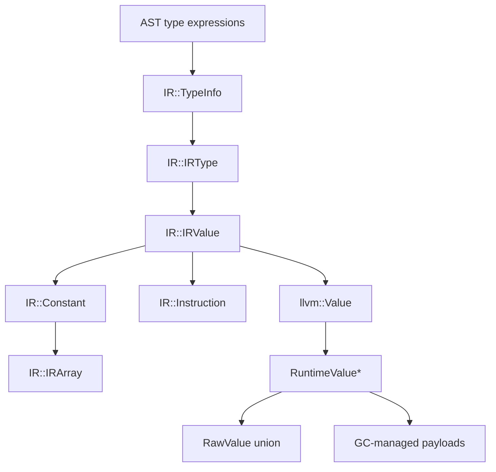

# SakuraE Value System

[Chinese Version](value-zh_cn.md)

This document describes the value representations used by the frontend, SakuraE IR, LLVM code generation, and the runtime library. The layers are related by conversion; they are not an inheritance hierarchy across compiler and runtime layers.

## 1. Layered model



`IRValue` is the compiler IR representation. `llvm::Value` is the LLVM representation produced by code generation. `RuntimeValue` is the runtime representation used by generated calls such as `__print`; it is not an LLVM subclass and does not inherit from `llvm::Value`.

## 2. Compile-time type information

`TypeInfo` describes source-language types while the frontend and IR are being built. During LLVM code generation it is lowered to a cached `Runtime::TypeInfo` object when a type value is materialized.

```cpp
enum TypeID {
    Int32,
    Int64,
    UInt32,
    UInt64,
    Float32,
    Float64,
    Bool,
    Char,
    String,
    Null,
    Custom,
    Array,
    Pointer,
    Ref
};

class ArrayTypeInfo {
    std::vector<TypeInfo*> elementTypes;

public:
    ArrayTypeInfo(std::vector<TypeInfo*> elements);
    std::size_t length();
    TypeInfo* getElementTy();
};

class PointerTypeInfo {
    TypeInfo* elementType;

public:
    PointerTypeInfo(TypeInfo* element);
    TypeInfo* getElementTy();
};

class RefTypeInfo {
    TypeInfo* elementType;

public:
    RefTypeInfo(TypeInfo* element);
    TypeInfo* getElementTy();
};

class TypeInfo {
    TypeID typeID;
    std::variant<
        std::monostate,
        ArrayTypeInfo,
        PointerTypeInfo,
        RefTypeInfo
    > complexTypeInfo;

public:
    TypeInfo(TypeID tid);
    TypeInfo(std::vector<TypeInfo*> tids);
    TypeInfo(TypeID id, TypeInfo* elementType);
    ~TypeInfo() = default;

    bool isArray();
    bool isPointer();
    bool isRef();
    const TypeID& getTypeID();
    IRType* toIRType();

    static TypeInfo* makeBasicTypeID(TypeID typeID);
    static TypeInfo* makeArrayTypeID(std::vector<TypeInfo*> types);
    static TypeInfo* makePointerTypeID(TypeInfo* typeID);
    static TypeInfo* makeRefTypeID(TypeInfo* typeID);
    static void clearAll();
};
```

`TypeInfo::toIRType()` maps basic types to singleton-like `IRType` instances, arrays to `IRArrayType`, pointers to `IRPointerType`, and references to an IR pointer type with the referenced element type.

## 3. IR types and values

The current IR type identifiers are:

```cpp
enum IRTypeID {
    VoidTyID,
    Integer32TyID,
    Integer64TyID,
    IntegerNTyID,
    UInteger32TyID,
    UInteger64TyID,
    UIntegerNTyID,
    Float32TyID,
    Float64TyID,
    FloatNTyID,
    CharTyID,
    BoolTyID,
    TypeInfoTyID,
    StringTyID,
    RefTyID,
    PointerTyID,
    ArrayTyID,
    FunctionTyID,
    BlockTyID
};
```

The base IR value is:

```cpp
class IRValue {
protected:
    IRType* type;
    fzlib::String name;

public:
    explicit IRValue(IRType* ty, fzlib::String n);
    explicit IRValue(IRType* ty);
    virtual ~IRValue() = default;

    IRType* getType() const;
    void setName(const fzlib::String& n);
    void setType(IRType* t);
    const fzlib::String& getName();
};
```

An instruction is an `IRValue` with an operation and operands:

```cpp
class Instruction : public IRValue {
    OpKind kind = OpKind::empty;
    std::vector<IRValue*> args;
    Block* parent = nullptr;

public:
    Instruction(OpKind k, IRType* t);
    Instruction(OpKind k, IRType* t, std::vector<IRValue*> params);

    bool isTerminal();
    bool isLValue();
    bool isRValue();
    void setParent(Block* blk);
    Block* getParent();
    const std::vector<IRValue*>& getOperands();
    IRValue* arg(std::size_t pos);
    const OpKind& getKind();
    IRValue* operator[](std::size_t pos);
    fzlib::String toString();
};
```

## 4. Constants and arrays

`Constant` stores compile-time values in a `std::variant` and retains the IR type separately:

```cpp
class Constant : public IRValue {
private:
    std::variant<
        std::monostate,
        std::int32_t,
        std::int64_t,
        std::uint32_t,
        std::uint64_t,
        double,
        float,
        fzlib::String,
        std::int8_t,
        bool,
        TypeInfo*,
        IRArray*
    > content;
    PositionInfo createInfo;

public:
    static Constant* get(std::uint32_t value, PositionInfo info = {});
    static Constant* get(std::uint64_t value, PositionInfo info = {});
    static Constant* get(std::int64_t value, PositionInfo info = {});
    static Constant* get(std::int32_t value, PositionInfo info = {});
    static Constant* get(float value, PositionInfo info = {});
    static Constant* get(double value, PositionInfo info = {});
    static Constant* get(const fzlib::String& value, PositionInfo info = {});
    static Constant* get(std::int8_t value, PositionInfo info = {});
    static Constant* get(bool value, PositionInfo info = {});
    static Constant* get(TypeInfo* value, PositionInfo info = {});
    static Constant* get(IRArray* value, PositionInfo info = {});
    static Constant* getDefault(IRType* type, PositionInfo info);
    static Constant* getFromToken(const Token& token);
    static void clearAll();

    template<typename T>
    const T& getContentValue() const;

    const PositionInfo& getInfo() const;
    fzlib::String toString();
    llvm::Type* toLLVMType(llvm::LLVMContext& context);
};
```

`IRArray` is an IR-time aggregate. Its constructor verifies that all elements have the same IR type. It is not the heap payload used by the runtime:

```cpp
class IRArray {
    std::vector<IRValue*> arrContent;
    PositionInfo createInfo;

public:
    IRArray(std::vector<IRValue*> values, PositionInfo info);
    IRType* getType();
    std::vector<IRValue*>& getArray();
    IRValue* getHead();
    std::size_t getSize();
    PositionInfo& getInfo();
    bool isEqual(std::vector<IRValue*> values);

    static IRArray* createArray(std::vector<IRValue*> values, PositionInfo info);
    static void clearArrayPool();
};
```

## 5. RuntimeValue

The runtime uses a tagged wrapper. The wrapper is passed by pointer across the generated-code/runtime boundary.

```cpp
enum class RuntimeType : std::uint8_t {
    I8,
    I32,
    I64,
    U8,
    U32,
    U64,
    F32,
    F64,
    Bool,
    String,
    Array,
    Struct,
    Pointer,
    TypeInfo
};

struct RuntimeString {
    const char* data;
    std::uint64_t length;
};

struct RuntimeAggregate {
    void* data;
    std::uint64_t length;
    std::uint64_t stride;
    const void* layout;
};

union RawValue {
    std::int8_t i8;
    std::int32_t i32;
    std::int64_t i64;
    std::uint8_t u8;
    std::uint32_t u32;
    std::uint64_t u64;
    float f32;
    double f64;
    bool boolean;
    RuntimeString string;
    RuntimeAggregate aggregate;
    void* pointer;
};

struct RuntimeValue {
    RuntimeType type;
    RawValue data;
};

extern "C" RuntimeValue* __runtime_alloc_value();
```

The current ABI has a one-byte tag followed by ABI padding and a 32-byte raw union. LLVM models it as:

```llvm
%sakurae.RuntimeValue = type { i8, [7 x i8], [4 x i64] }
```

The generated code always uses `RuntimeValue*`; it does not pass `RuntimeValue` by value. Scalar values use the corresponding union member. Strings use `RuntimeString`. Arrays and structs use `RuntimeAggregate` when represented as boxed runtime values. The current implementation still has a `Pointer` tag for boxed pointer values.

## 6. LLVM boxing

`LLVMCodeGenerator::boxRaw(llvm::Value*, IR::IRType*, LLVMFunction*)` allocates a wrapper, writes the runtime tag, and stores the raw value in the union storage. `unboxRaw(llvm::Value*, IR::IRType*, LLVMFunction*)` loads the raw field using the IR type's LLVM type.

The current tag mapping is:

| IR type | Runtime tag |
| --- | ---: |
| `CharTyID` | `I8` / 0 |
| `Integer32TyID` | `I32` / 1 |
| `Integer64TyID` | `I64` / 2 |
| `UInteger32TyID` | `U32` / 4 |
| `UInteger64TyID` | `U64` / 5 |
| `Float32TyID` | `F32` / 6 |
| `Float64TyID` | `F64` / 7 |
| `BoolTyID` | `Bool` / 8 |
| `StringTyID` | `String` / 9 |
| `ArrayTyID` | `Array` / 10 |
| `PointerTyID` | `Pointer` / 12 |
| `RefTyID` | `Pointer` / 12 |
| `TypeInfoTyID` | `TypeInfo` / 13 |
| fallback | `Pointer` / 12 |

`U8` and `Struct` are defined by the runtime ABI, but the current IR tag function does not expose independent complete code-generation paths for them. This is an implementation status, not a statement that those enum members are unavailable in the ABI.

## 7. GC ownership and roots

`RuntimeValue` wrappers are allocated with `malloc` by `__runtime_alloc_value()` and tracked by the runtime for shutdown cleanup. They are not themselves GC payload objects. Payload ownership is separate:

- string character storage is allocated by `__gc_alloc` as an atomic object;
- array storage is allocated by `__gc_alloc` and its elements are `RuntimeValue*` under the current full-boxing implementation;
- struct payload support and layout metadata exist in the GC API, although the current language path does not yet generate complete struct values;
- a boxed `RuntimeValue` is registered/scanned according to its tag by `__gc_register_value`, `__gc_register_value_slot`, and `__gc_scan_value`.

The wrapper pointer must remain reachable while its payload is needed. Generated code therefore creates root slots for boxed values that can survive an allocation or call. The GC does not scan native C++ stack frames implicitly.

## 8. TypeInfo in the runtime

`TypeInfo*` is a variant alternative in `IR::Constant` and `TypeInfoTyID` exists in the IR type system. LLVMCodegen lowers the pointed-to IR type recursively through the Runtime type-info factories. The resulting `RuntimeValue` uses `RuntimeType::TypeInfo` and stores a resident `Runtime::TypeInfo*` in the pointer slot. It is therefore distinct from `RuntimeType::Pointer`.

Runtime type metadata is immutable after construction and cached by type structure. Basic types are interned, while pointer, reference, array, and struct metadata are interned by their element/layout keys. The metadata can later be extended with reflection operations without copying it into each `RuntimeValue`.

## 9. Pointer and reference semantics

`Ptr<T>`/pointer and reference types belong to the IR type and address-calculation layers. `Ref<T>` is currently lowered by `TypeInfo::toIRType()` to an IR pointer type, and IR instructions such as `create_alloca`, `indexing`, `gaddr`, and `deref` operate on storage addresses.

This does not make `RuntimeType::Pointer` redundant in the current implementation. The distinction is:

- an IR pointer/reference can be an address of a language storage slot and need not be wrapped as a `RuntimeValue` merely to perform load/store/deref;
- a pointer passed as a first-class boxed runtime value can use `RuntimeType::Pointer`, whose union member is `void*`, and the GC can scan the pointed payload when registered.

Therefore the current compatible design is:

```text
IR Ptr/Ref: address and storage semantics
RuntimeValue::Pointer: boxed pointer-value semantics
```

For a first-class address expression, LLVMCodegen stores the address itself in `RawValue::pointer` and passes the wrapper as `RuntimeValue*`. Dereference and pointer indexing unbox this field before performing memory operations. The wrapper address is never used as the pointer payload.

If the language later forbids pointers as first-class values, `RuntimeType::Pointer` can be removed, but code generation, runtime GC scanning, printing, and ABI declarations must be changed together.

## 10. Current limitations

- `TypeInfo` lowering currently covers basic types, pointers, references, and arrays. Struct metadata has a Runtime factory, but the language IR does not yet generate complete struct type descriptions.
- `RuntimeType::U8` and `RuntimeType::Struct` are present in the ABI but are not fully covered by the current IR tag mapping.
- RuntimeValue wrappers and GC payloads have separate ownership systems; registering a payload does not automatically free its wrapper.
- Arrays are fully boxed as arrays of `RuntimeValue*`; this is a representation choice made by the current code generator, not a requirement of `IRArray`.
